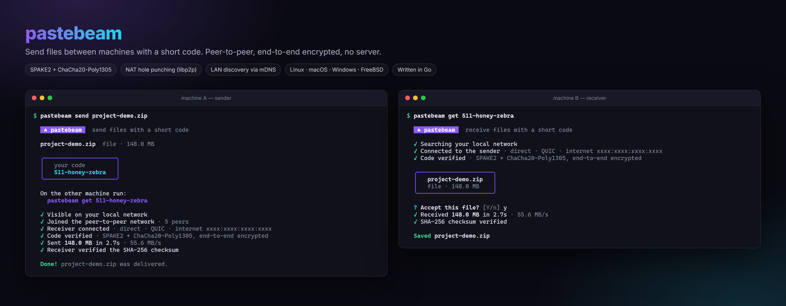
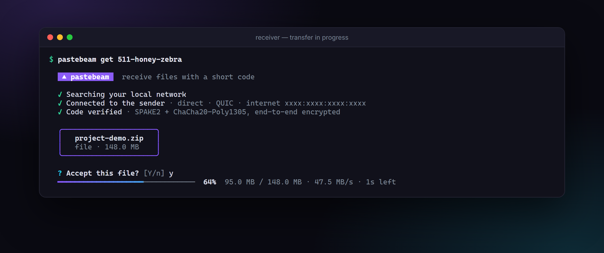
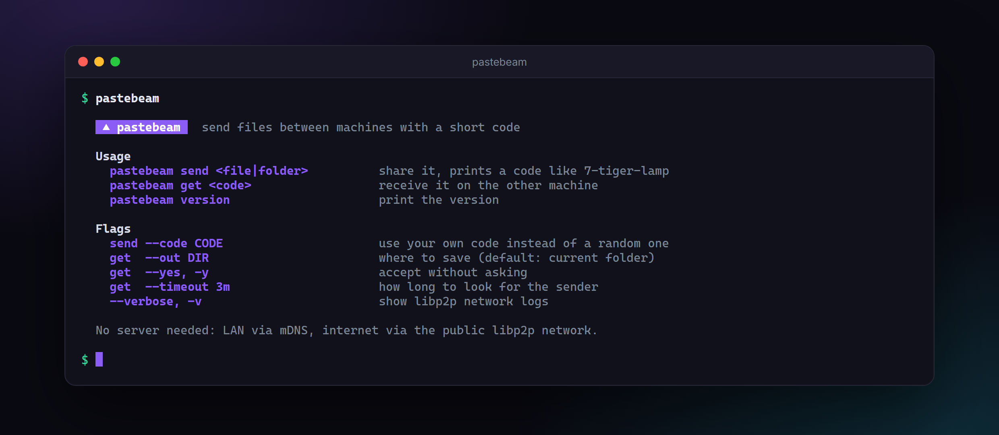

# pastebeam

Send files between machines with a short code. End-to-end encrypted, peer-to-peer, **no server to run**.



```sh
pastebeam send project.zip       # prints a code like 511-honey-zebra
pastebeam get 511-honey-zebra    # on the other machine
```

Works between Linux, macOS, Windows and FreeBSD, in any combination. Send single files or whole folders.

<p align="center">
  
  
</p>

## Install

**Linux / macOS** (detects your distro's architecture, verifies the checksum):

```sh
curl -fsSL https://raw.githubusercontent.com/KhadeerBasha1232/pastebeam/main/install.sh | sh
```

**Linux packages** from the [releases page](https://github.com/KhadeerBasha1232/pastebeam/releases):

| Distro | Install |
|---|---|
| Debian / Ubuntu / Mint / Pop!_OS | `sudo apt install ./pastebeam_*_amd64.deb` |
| Fedora / RHEL / Rocky / openSUSE | `sudo dnf install ./pastebeam-*.x86_64.rpm` |
| Alpine | `sudo apk add --allow-untrusted ./pastebeam_*.apk` |
| Arch / Manjaro | `sudo pacman -U ./pastebeam-*.pkg.tar.zst` |

Builds exist for `x86_64`, `arm64` (e.g. Raspberry Pi 4/5, Graviton) and `armv7`.

**Windows**: download `pastebeam_*_windows_x86_64.zip` from the releases page and put `pastebeam.exe` on your `PATH`.

**From source** (Go 1.26+): `go install github.com/KhadeerBasha1232/pastebeam@latest`

## Usage

```sh
pastebeam send photo.jpg          # prints a code like 7-tiger-lamp
pastebeam send ./my-folder        # folders work too
pastebeam get 7-tiger-lamp        # on the other machine

pastebeam send file.zip --code 12-pick-your-own
pastebeam get 7-tiger-lamp --out ~/Downloads --yes
```

Set `CLICOLOR_FORCE=1` to keep colors when piping or recording the output.

## How it works

```
 sender                                                  receiver
   │  1. find each other                                    │
   │     LAN:      mDNS multicast                           │
   │     internet: public libp2p/IPFS DHT, key = nameplate "7"
   │  2. connect                                            │
   │     direct dial, or via a public relay + hole punch    │
   │  3. SPAKE2 with password "7-tiger-lamp" ───────────────│
   │     → same strong key on both sides, nobody else learns it
   │  4. ChaCha20-Poly1305 encrypted chunks + SHA-256 ──────▶
```

- **Code**: the number (`7`) is a public *nameplate* used only to find each other. The words are the password and never leave your machine.
- **SPAKE2** (a PAKE) turns the short code into a strong shared key. An attacker who intercepts everything still can't brute-force the code offline; they get one online guess per try, and the sender quits after 3 wrong attempts.
- The PAKE is bound to both peers' libp2p identities, and the keys are split with HKDF into separate keys per direction. Every chunk is sealed with ChaCha20-Poly1305 using counter nonces, so chunks can't be reordered, replayed or modified without detection.
- **NAT traversal**: the sender reserves a slot on a public libp2p relay (any IPFS node that offers one). The receiver dials through it and libp2p *hole-punches* (DCUtR) a direct connection. File data never goes through a relay.
- The receiver writes to a temporary file and only renames it into place after the checksum matches. Folders are streamed as tar and extracted safely: paths can't escape the target folder and symlinks are skipped.

**Limitation**: with no server of its own, a transfer fails if both machines are behind strict NATs (some mobile carriers, corporate firewalls) that can't be hole-punched. LAN transfers and most home networks work.

## Building a release

Push a tag and GitHub Actions builds every platform with GoReleaser:

```sh
git tag v0.1.0 && git push origin v0.1.0
```

## License

MIT
